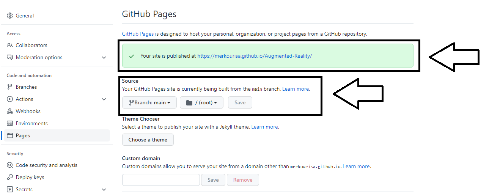
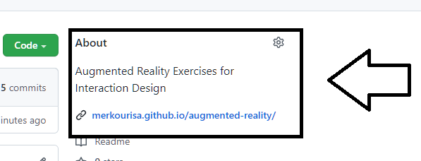

# Developing Interactive Augmented Reality Applications

The purpose of this individual assignment is to develop interactive augmented reality applications. You will use [AR.js](https://github.com/AR-js-org/AR.js) an augmented reality library and [Α-Frame](https://github.com/aframevr/aframe) a virtual reality library. 
You must first create a [Github](https://github.com/) account, using the university email, and then fork the [repository](https://github.com/merkourisa/Augmented-Reality). Finally, you have to complete all the tasks described in the open [issues](https://github.com/merkourisa/Augmented-Reality/issues) of the assignment.

## Initial Settings
- As long as you have forked the [repository](https://github.com/merkourisa/Augmented-Reality), the executables and the assets of the augmented reality applications must have been copied in your github repository.

- Activate Github Pages in the Settings of your reposity  and *change the link of your repository to target your application.*

## Setting up the Web Application Development Environmnent
- You can use [Github Desktop](https://desktop.github.com/) to download the files from your repository locally on your computer. 
- Afterwards, you have to use an Integrated Development Environment (IDE) to edit the html and javascript source code. Suggested ΙDE: [Brachets](https://brackets.io/) or [Αtom](https://atom.io/).
- Additionally, you have to set up a local web server, so you can run the Web applications locally, while you develop them. See the instructions [here](https://aframe.io/aframe-school/#/2/5). Suggested Web server: [python 3 http.server](https://developer.mozilla.org/en-US/docs/Learn/Common_questions/set_up_a_local_testing_server).
- After you develop the augmented reality applications, according to the tasks described in the issues, you have to use [Github Desktop](https://desktop.github.com/) to upload the local files from your computer on your repository. In this way, the applications will run directly on Github Pages.

**Attention:** For assessing the applications and grading the individual assignment, all executables (_.html_) and _assets_ must be uploaded on your Github page.

## Grading 
Taking into account the percentage of the individual assignment in the final grade (5 points). Each deliverable is graded as follows:
- Tasks described in [deliverable 1](https://github.com/merkourisa/Augmented-Reality/issues/1): up to +1.5 points. 
- Tasks described in [deliverable 2](https://github.com/merkourisa/Augmented-Reality/issues/2): up to +2 points.
- Tasks described in [deliverable 3](https://github.com/merkourisa/Augmented-Realityr/issues/3): up to +1.5 points.

## Deadlines
- [deliverable 1](https://github.com/merkourisa/Augmented-Reality/issues/1): until 25/03/2022 
- [deliverable 2](https://github.com/merkourisa/Augmented-Reality/issues/2): until 29/04/2022
- [deliverable 3](https://github.com/merkourisa/Augmented-Reality/issues/3): until 03/06/2022

## Report
In each deliverable, you should also modify your personal [report](my_report/README.md), describing in detail what have you done in each deliverable.

## Questions

For any questions, regarding the deliverables, in the open [issues](https://github.com/merkourisa/Augmented-Reality/issues) not only you can ask but you can also answer. 

## Resources

- [A-Frame Library](https://github.com/aframevr/aframe)
- [Α-Frame School](https://aframe.io/aframe-school/#/)
- [AR.js Library](https://github.com/AR-js-org/AR.js)
- [Blog AR + A-Frame](https://aframe.io/blog/arjs/#customize-your-marker)
- [html Tutorial](https://www.w3schools.com/html/default.asp)
- [Javascript Tutorial](https://www.w3schools.com/js/)
- [Basic writing and formatting syntax in Github](https://docs.github.com/en/get-started/writing-on-github/getting-started-with-writing-and-formatting-on-github/basic-writing-and-formatting-syntax)
